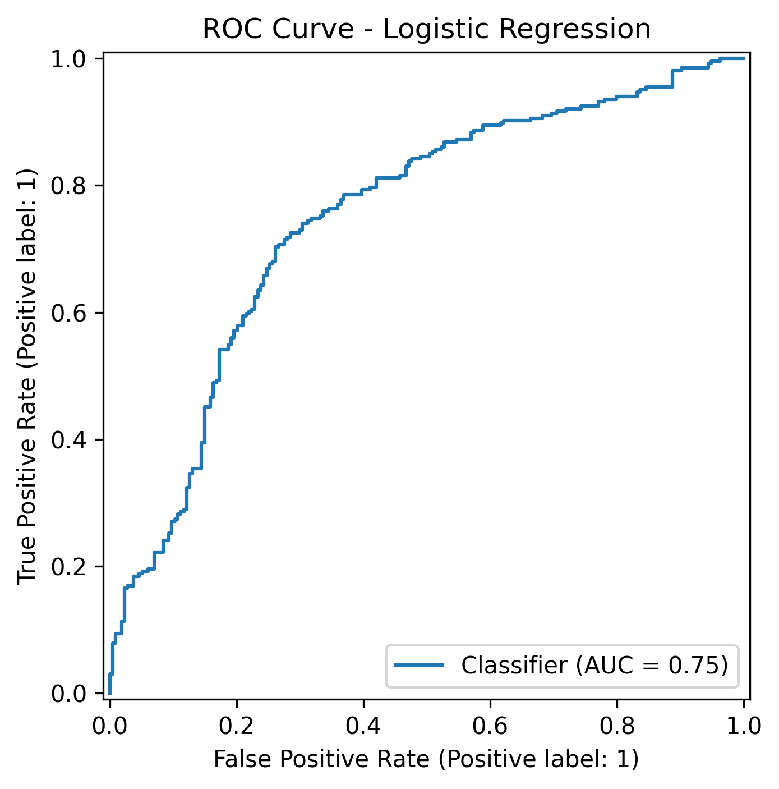

# How NFL Fans Can Turn Pregame Data into Game-Day Predictions

## Hook

Every NFL week, fans, analysts, and teams try to answer the same question before kickoff: who is more likely to win? This project turns that question into a structured data problem by building a reproducible NFL dataset and using pregame information to estimate whether the home team will win. Instead of relying only on intuition, headlines, or team reputation, it uses historical team form, recent performance, and pregame market signals to make the forecast more evidence-based.

## Problem Statement

Predicting NFL game outcomes is difficult because football is noisy. Teams can have the same record while playing at very different underlying levels, and game results can be influenced by matchup context, short-term form, rest, and public expectations. A simple win-loss record often misses those details.

That creates a practical sports-analytics problem: how can we estimate the likely outcome of an NFL game **before** it starts using information that would actually have been available at the time? A good answer to that question needs to avoid cheating by using postgame information, and it needs to organize the data in a way that makes team history, game context, and prediction inputs easy to understand.

This project focuses on one specific version of that larger problem: **predicting whether the home team will win an NFL regular-season game using only pregame information**. That refined problem is narrower, more realistic, and better suited for a true forecasting pipeline than simply explaining the result after the game is over.

The challenge is that schedule-level football data by itself can still be limited. Historical scoring averages and prior win percentage help, but they are not always strong enough on their own. To build a more useful prediction system, this project combines multiple kinds of pregame information:
- long-term team form, such as prior win percentage and point differential
- short-term team form, such as performance over the most recent three games
- schedule context, such as rest differences
- public market expectations, such as point spreads, moneylines, and implied probabilities

By combining those signals, the project aims to create a more realistic pregame estimate of the home team’s chance to win.

## Solution Description

To solve this problem, I built a relational secondary dataset from NFL data accessed through the `nflreadpy` package. Instead of using one flat spreadsheet, I organized the project into four linked tables:

1. **`teams`** — a reference table containing team identifiers and metadata  
2. **`games`** — one row per completed NFL regular-season game  
3. **`team_games`** — one row per team per game, used to calculate rolling historical summaries  
4. **`matchups`** — one row per game containing the final pregame features used for prediction  

This structure matters because it allows the project to compute pregame features safely. For example, the `team_games` table makes it possible to calculate each team’s prior win percentage, prior scoring average, prior points allowed average, and recent three-game form using only earlier games. Those values are then merged into the `matchups` table so that each game has one final row containing both teams’ pregame signals.

A major improvement in the final version of the project was adding stronger pregame context from the raw NFL schedule data. Earlier versions that relied mainly on rolling team-form features were not strong enough. The final solution still uses team-form summaries, but it also includes:
- spread line
- moneyline odds
- implied win probabilities from moneylines
- rest measures
- division-game indicator
- weather-related context such as temperature and wind when available

That combination is important because it reflects the actual information environment before an NFL game begins. Team form captures how the teams have been performing, while market and schedule features capture broader expectations and context.

To evaluate the prediction problem, I compared two different classification models:
- Logistic Regression
- Random Forest

Logistic regression was used as the main interpretable baseline because the target is binary: either the home team wins or it does not. Random forest was included as a more flexible comparison model that can capture nonlinear relationships among pregame variables.

The final model was selected using **validation ROC AUC** rather than test performance so that the held-out test set remained a cleaner measure of out-of-sample performance. Based on that comparison, **Logistic Regression** was chosen as the final model.

The final results were:

- **Validation Accuracy:** 0.669  
- **Validation ROC AUC:** 0.716  
- **Test Accuracy:** 0.708  
- **Test ROC AUC:** 0.748  

Those results mean the model performed meaningfully better than simple guessing and did a reasonably strong job ranking likely home-team wins above likely home-team losses. On the held-out test set, the final confusion matrix showed:

- 131 true negatives  
- 209 true positives  
- 83 false positives  
- 57 false negatives  

Overall, that means the final system was able to classify about **71%** of test games correctly while also achieving an ROC AUC of about **0.75**, which suggests that the model learned real predictive signal from the pregame data rather than depending only on the majority class.

More broadly, the project shows that schedule-level NFL data can become much more useful when it is transformed into a relational dataset and combined with carefully chosen pregame features. The goal is not to claim perfect prediction. NFL games are too complex for that. Instead, the goal is to build a transparent, reproducible, and evidence-based forecasting pipeline that improves on intuition-only prediction and can be extended in future work.

## Chart

This chart shows the performance of the final logistic-regression model on held-out test data. The ROC curve summarizes how well the model separates home-team wins from home-team losses across many possible classification thresholds. The curve stays well above the diagonal random-guessing baseline test accuracy (**55%**), and the **AUC of 0.75** indicates that the model captures meaningful pregame signal. In practical terms, that means the final pipeline is doing more than guessing: it is using team form, recent form, rest, and market context to rank likely winners more effectively before the game begins.
